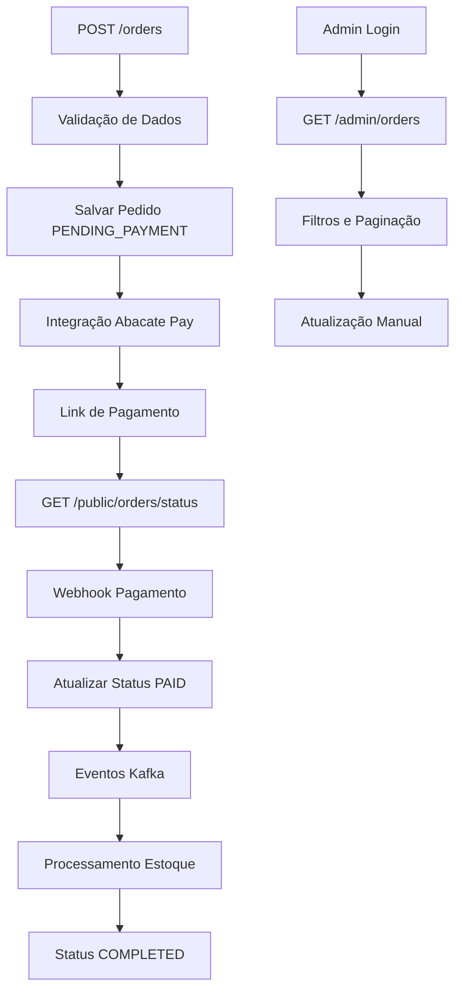

## 1. Visão Geral do Produto

OrderHub é um sistema central de processamento de pedidos desenvolvido em Java Spring Boot, integrado a múltiplos serviços internos e externos incluindo gateway de pagamentos, controle de estoque, mensageria e APIs públicas e administrativas.

- O sistema resolve o problema de centralização e orquestração de pedidos em um ambiente distribuído, permitindo que empresas gerenciem todo o ciclo de vida dos pedidos de forma eficiente.
- O produto atende equipes de desenvolvimento, administradores de sistema e clientes finais que precisam acompanhar seus pedidos.
- Valor de mercado: solução enterprise para e-commerce e marketplaces que precisam de alta disponibilidade e integração com múltiplos sistemas.

## 2. Funcionalidades Principais

### 2.1 Papéis de Usuário

| Papel | Método de Registro | Permissões Principais |
|-------|-------------------|----------------------|
| Cliente | Criação automática durante pedido | Consultar status de pedidos próprios |
| Administrador | Acesso básico (admin:senha123) | Gerenciar todos os pedidos, filtros avançados, atualizações manuais |
| Sistema Externo | Integração via webhook/API | Receber e enviar eventos de pagamento e estoque |

### 2.2 Módulos de Funcionalidade

Nossos requisitos do OrderHub consistem nas seguintes páginas principais:

1. **API de Pedidos**: criação de pedidos, validação de dados, persistência no banco.
2. **API Pública de Status**: consulta reativa de status de pedidos por ID ou email.
3. **Painel Administrativo**: listagem, filtros e gerenciamento de pedidos.
4. **Webhook de Pagamento**: recebimento de notificações do gateway Abacate Pay.
5. **Sistema de Mensageria**: orquestração de eventos via Kafka.

### 2.3 Detalhes das Páginas

| Nome da Página | Nome do Módulo | Descrição da Funcionalidade |
|----------------|----------------|-----------------------------|
| API de Pedidos | Criação de Pedidos | Receber pedido via POST /orders, validar dados do cliente e itens, salvar com status PENDING_PAYMENT, retornar ID e link de status |
| API de Pedidos | Validação de Negócio | Validar estoque mínimo, formato de dados, regras de negócio usando Spring Validation |
| API de Pedidos | Mapeamento DTO/Entity | Converter automaticamente entre DTOs e entidades usando MapStruct |
| API de Pedidos | Eventos Kafka | Publicar evento orders.created após criação do pedido |
| API Pública de Status | Consulta Reativa | Permitir consulta de status via GET /public/orders/{id}/status usando Spring WebFlux |
| API Pública de Status | Rate Limiting | Proteger endpoint contra abuso com limitação de taxa |
| API Pública de Status | Streaming em Tempo Real | Fornecer Flux com updates em tempo real do status |
| Painel Administrativo | Listagem com Paginação | Listar pedidos com paginação usando Pageable |
| Painel Administrativo | Filtros Dinâmicos | Filtrar por status, data, cliente usando Specification |
| Painel Administrativo | Atualização Manual | Permitir atualização manual de status em casos de erro |
| Painel Administrativo | Histórico de Pagamentos | Consultar histórico completo de transações |
| Webhook de Pagamento | Recebimento de Notificações | Receber webhook /webhook/abacate do gateway de pagamento |
| Webhook de Pagamento | Verificação de Segurança | Validar assinatura HMAC para segurança |
| Webhook de Pagamento | Atualização de Status | Atualizar status do pedido (PAID, FAILED) baseado na resposta |
| Webhook de Pagamento | Eventos de Pagamento | Publicar evento payments.confirmed no Kafka |
| Sistema de Mensageria | Produção de Eventos | Emitir eventos orders.created e payments.confirmed |
| Sistema de Mensageria | Consumo de Eventos | Consumir stock.reserved e invoice.generated para atualizar status |
| Sistema de Mensageria | Tratamento de Falhas | Implementar retry e Dead Letter Queue (DLQ) |
| Integração Abacate Pay | Cliente Feign | Interface AbacatePayClient com endpoints mockados |
| Integração Abacate Pay | Gerenciamento de Clientes | Criar cliente no Abacate Pay se não existir |
| Integração Abacate Pay | Criação de Cobrança | Criar cobrança e obter link de pagamento |
| Integração Abacate Pay | Persistência de Transação | Salvar ID da transação Abacate no banco |

## 3. Processo Principal

**Fluxo do Cliente:**
1. Cliente envia pedido via POST /orders
2. Sistema valida dados e cria pedido com status PENDING_PAYMENT
3. Sistema integra com Abacate Pay para criar cobrança
4. Cliente recebe link de pagamento
5. Cliente consulta status via GET /public/orders/{id}/status
6. Sistema recebe webhook de confirmação de pagamento
7. Status é atualizado para PAID e eventos são publicados
8. Serviços externos processam estoque e faturamento
9. Status final é atualizado para COMPLETED

**Fluxo do Administrador:**
1. Admin acessa painel via autenticação básica
2. Lista pedidos com filtros (status, data, cliente)
3. Visualiza detalhes e histórico de pagamentos
4. Atualiza status manualmente se necessário

## 4. Design da Interface do Usuário

### 4.1 Estilo de Design

- **Cores Primárias**: #2563eb (azul), #059669 (verde para sucesso)
- **Cores Secundárias**: #64748b (cinza), #dc2626 (vermelho para erros)
- **Estilo de Botões**: Arredondados com sombra sutil
- **Fonte**: Inter, tamanhos 14px (corpo), 16px (títulos), 12px (labels)
- **Layout**: Card-based com navegação superior fixa
- **Ícones**: Lucide icons para consistência

### 4.2 Visão Geral do Design das Páginas

| Nome da Página | Nome do Módulo | Elementos da UI |
|----------------|----------------|----------------|
| API de Pedidos | Resposta JSON | Formato JSON limpo com ID do pedido, status e link de consulta |
| API Pública de Status | Consulta de Status | Resposta JSON reativa com status atual, timestamp e detalhes do pedido |
| Painel Administrativo | Lista de Pedidos | Tabela responsiva com colunas: ID, Cliente, Status, Data, Valor, Ações |
| Painel Administrativo | Filtros | Formulário horizontal com campos: Status (select), Data (date picker), Cliente (input text) |
| Painel Administrativo | Paginação | Componente de paginação com números de página e controles anterior/próximo |
| Webhook de Pagamento | Log de Eventos | Interface de monitoramento com lista de webhooks recebidos e status de processamento |

### 4.3 Responsividade

O sistema é desktop-first com adaptação para mobile. O painel administrativo é otimizado para desktop, enquanto a API pública é acessível via mobile. Não há otimização específica para touch, focando em integração via API.