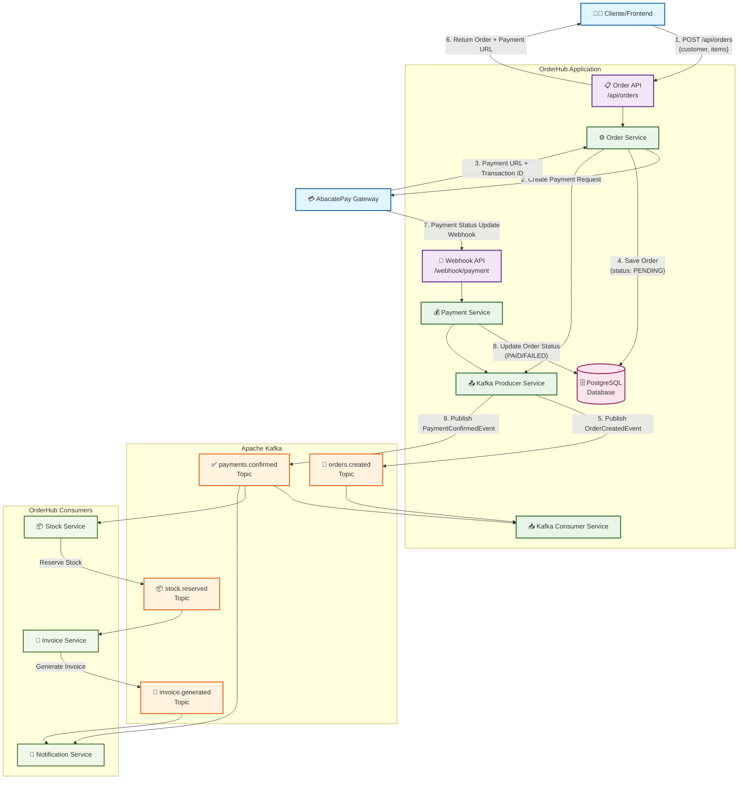

# Arquitetura da Aplicação OrderHub

## Diagrama de Arquitetura

## Fluxo Detalhado

### 1. Criação de Pedido
1. **Cliente** envia requisição POST para `/api/orders` com dados do pedido
2. **Order Service** processa a requisição e cria uma solicitação de pagamento no **AbacatePay**
3. **AbacatePay** retorna URL de pagamento e Transaction ID
4. **Order Service** salva o pedido no banco com status `PENDING`
5. **Kafka Producer** publica evento `OrderCreatedEvent` no tópico `orders.created`
6. API retorna o pedido criado com URL de pagamento para o cliente

### 2. Processamento de Pagamento
7. **AbacatePay** envia webhook para `/webhook/payment` quando status do pagamento muda
8. **Payment Service** processa o webhook e atualiza status do pedido no banco
9. **Kafka Producer** publica evento `PaymentConfirmedEvent` no tópico `payments.confirmed`

### 3. Processamento de Eventos
- **Kafka Consumers** da própria aplicação processam eventos internamente
- **Stock Service** escuta `payments.confirmed` e reserva estoque
- **Invoice Service** escuta `stock.reserved` e gera nota fiscal
- **Notification Service** escuta múltiplos eventos para enviar notificações

## Características da Arquitetura

### ✅ Vantagens
- **Event-Driven**: Desacoplamento entre serviços via Kafka
- **Resiliente**: Dead Letter Topics para tratamento de falhas
- **Escalável**: Particionamento de tópicos Kafka
- **Observável**: Logging detalhado em todos os componentes
- **Idempotente**: Configuração de producers para evitar duplicatas

### 🔧 Componentes Técnicos
- **Spring Boot 3.5.4** com Java 21
- **Apache Kafka** para messaging
- **PostgreSQL** como banco principal
- **AbacatePay** como gateway de pagamento
- **Spring Security** para autenticação
- **Docker** para containerização

### 📊 Tópicos Kafka
- `orders.created` - Eventos de pedidos criados
- `payments.confirmed` - Confirmações de pagamento
- `stock.reserved` - Reservas de estoque
- `invoice.generated` - Notas fiscais geradas
- Tópicos DLT para cada um dos acima

### 🔄 Padrões Implementados
- **Saga Pattern** para transações distribuídas
- **Event Sourcing** para auditoria de eventos
- **CQRS** separação de comandos e consultas
- **Circuit Breaker** para resiliência
- **Webhook Pattern** para integração com gateway de pagamento